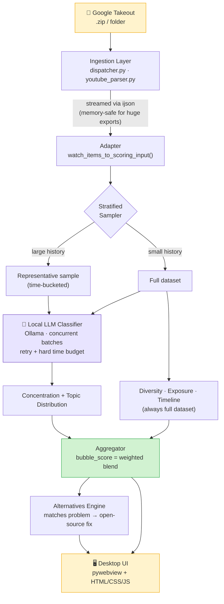

<div align="center">

# 🫧 OpenTrace

### See the filter bubble your algorithm built around you — without a single byte leaving your device.

[](https://www.python.org/)
[](#-privacy-by-design)
[](https://ollama.com)
[](#-license)
[](#-built-for)

**Built for [Reclaim Hackathon] — Local-First & Data Ownership track**

[Overview](#-overview) •
[How It Works](#-how-it-works) •
[Quick Start](#-quick-start) •
[Architecture](#-architecture) •
[The Bubble Score](#-how-the-bubble-score-is-calculated) •
[Team](#-team)

</div>

---

## 🌊 Overview

Every time you open YouTube, an algorithm you can't see decides what you watch next. Over months, that quietly narrows into a **filter bubble** — a feed that reflects back a shrinking slice of the world.

**OpenTrace** is a local desktop app that reads your own YouTube data export, measures exactly how closed that bubble has become, and shows you the open-source path out of it.

No cloud. No account. No API key. The AI model that analyzes your data runs **on your machine**, offline, via [Ollama](https://ollama.com) — the same promise the entire Open Web hackathon track is about: **you own your data, not a platform.**

> 🏆 **Eligibility highlights:** MIT-licensed · solves a real, well-defined problem (algorithmic filter bubbles) · realistic scope (one clear pipeline, not "rebuild YouTube") · privacy & data ownership by architecture, not by promise · extensible scoring/data layers for future platforms.

---

## ✨ How It Works

<table>
<tr>
<td width="20%" align="center">📂<br><b>1. Import</b></td>
<td>Point OpenTrace at your Google Takeout <code>.zip</code> (or an already-extracted folder). Nothing is uploaded anywhere — the file is read straight off your disk.</td>
</tr>
<tr>
<td align="center">🧠<br><b>2. Analyze</b></td>
<td>A local LLM (via Ollama) classifies a statistically representative sample of your watch history into topics, entirely offline.</td>
</tr>
<tr>
<td align="center">📊<br><b>3. Score</b></td>
<td>Four independent signals — <b>source diversity</b>, <b>topic concentration</b>, <b>algorithmic exposure</b>, and <b>channel manipulation</b> — combine into a single 0–100 <b>Bubble Score</b>.</td>
</tr>
<tr>
<td align="center">🌱<br><b>4. Escape</b></td>
<td>OpenTrace suggests real, federated, open-source alternatives (PeerTube, Mastodon, Funkwhale, RSS-Bridge…) matched to <i>why</i> your bubble formed.</td>
</tr>
</table>

---

## 🔐 Privacy by Design

This isn't a privacy *policy* — it's a privacy *architecture*. There is no server for your data to reach.

| | Typical "AI insights" app | OpenTrace |
|---|---|---|
| Where your watch history goes | Uploaded to a cloud API | **Never leaves your disk** |
| AI model | Hosted, third-party | **Runs locally via Ollama** |
| Account required | Usually | **None** |
| What we can see | Everything you send | **Nothing — there's nothing to send** |

---

## 🚀 Quick Start

### Prerequisites

| Requirement | Notes |
|---|---|
| **Python 3.10+** | Check *"Add python.exe to PATH"* on Windows during install |
| **[Ollama](https://ollama.com)** | Runs the local AI model |
| ~2–4 GB free disk | For the local model weights |

### Setup

```bash
# 1. Clone and enter the project
git clone https://github.com/AbdaullahAG/OpenTrace.git
cd OpenTrace

# 2. Create a virtual environment and install dependencies
python -m venv .venv
.venv\Scripts\activate        # Windows
# source .venv/bin/activate   # macOS / Linux
pip install -r requirements.txt

# 3. Install Ollama, then pull the model OpenTrace uses
#    (see https://ollama.com for the installer)
ollama pull qwen2.5:3b

# 4. Copy the example environment file and adjust if needed
cp .env.example .env
```

> Prefer `make`? `make setup` does steps 2–3 for you.

### Run it

```bash
python main.py
```

A native desktop window opens. Select your Takeout `.zip` (or the extracted folder), and OpenTrace does the rest — no browser, no server, no setup wizard.

### Run the test suite

```bash
python -m pytest test/ -v
```

---

## 🏗️ Architecture

OpenTrace is a local desktop app: a native window (via `pywebview`) wrapping a plain HTML/CSS/JS interface, backed by a pure-Python analysis engine. No web server, no database — just files and a local model.



### Tech stack

| Layer | Technology | Why |
|---|---|---|
| Desktop shell | [`pywebview`](https://pywebview.flowrl.com/) | Native window, no bundled browser, no web server |
| UI | HTML5 / CSS3 / vanilla JS | Zero build step, transparent to read/audit |
| Ingestion | `ijson` (streaming) | Multi-GB Takeout exports without exhausting RAM |
| Local AI | [Ollama](https://ollama.com) | Runs the classification model fully offline |
| Scoring | Pure Python | Deterministic, unit-tested, model-agnostic |
| Tests | `pytest` / `unittest` | Mocked LLM client — no live Ollama needed to test |

### Project structure

```
OpenTrace/
├── main.py                     # Entry point — pywebview window + exposed API
├── app/
│   ├── config.py                # .env-driven runtime settings
│   ├── constants.py              # Scoring weights, topic list, tuning knobs
│   ├── schemas.py                 # Shared data contracts (FeedItem, BubbleReport)
│   │
│   ├── ingestion/                 # Parses raw Takeout exports
│   │   ├── dispatcher.py            # Routes .zip / folder → parser, caches result
│   │   └── youtube_parser.py         # Streaming JSON parser (ijson)
│   │
│   ├── llm/                       # Local AI layer
│   │   ├── ollama_client.py         # Thin HTTP client for Ollama
│   │   ├── prompts.py                # Classification prompt + injection defenses
│   │   └── classifier.py             # Batching, concurrency, retries, caching
│   │
│   ├── scoring/                   # Pure-Python analysis (no network calls)
│   │   ├── diversity.py             # Shannon entropy over channels
│   │   ├── concentration.py          # Topic concentration
│   │   ├── exposure.py               # % watched outside your subscriptions
│   │   ├── sampler.py                 # Stratified time-based sampling
│   │   ├── security.py                # Input sanitization / prompt-injection defense
│   │   ├── alternatives.py            # Open-source alternative matching
│   │   └── aggregator.py              # Combines everything into the final report
│   │
│   ├── data/                      # media_sources.json, alternatives.json
│   └── gui/                       # index.html, app.js, bridge.js, style.css
│
└── test/                          # pytest suite (mocked Ollama client)
```

---

## 🎯 How the Bubble Score Is Calculated

Four independent, individually testable signals — each grounded in something measurable, not vibes:

| Signal | Weight | What it measures |
|---|---|---|
| **Source Diversity** | 30% | Shannon entropy over the channels you watch — the same metric used in ecology to measure species diversity |
| **Algorithmic Exposure** | 30% | Share of content watched from channels you never subscribed to — the clearest signal of what *the algorithm* chose vs. what *you* chose |
| **Topic Concentration** | 25% | How narrowly your content clusters into one topic, via local LLM classification |
| **Channel Dominance** | 15% | Whether a single channel disproportionately dominates your feed |

```
bubble_score = 100 × (
    0.30 × (1 − diversity)
  + 0.25 × concentration
  + 0.30 × algorithmic_exposure
  + 0.15 × dominant_channel_share
)
```

The report also surfaces **why** a result looks the way it does — including how many items were classified from cache, how many genuinely failed, and how many were dropped by the time budget — instead of quietly lumping everything into "other."

---

## 🌍 Built For

This project targets the **Local-First & Data Ownership** track of *A Hackathon for the Open Web*: tools that help people leave centralized platforms without losing what they have. OpenTrace doesn't just talk about the problem — it demonstrates it with your own data, then points to real federated alternatives already built by the open-source community: **PeerTube, Mastodon, Funkwhale, RSS-Bridge, AntennaPod.**

---

## 🗺️ Roadmap

- [ ] Browser extension for lower-friction onboarding
- [ ] TikTok export support (parser groundwork already in place)
- [ ] Optional political-lean signal via `media_sources.json`
- [ ] Desktop-native packaging (no `python main.py` required)

---

## 👥 Team

| Role | Name | Focus |
|---|---|---|
| **Backend** | AbedAlqader Alsadi | Ingestion pipeline, streaming parsers, data contracts |
| **Frontend** | Ahmad Ali | Desktop UI, results visualization, UX |
| **AI + Security** | Abdallah Abughallous | Local LLM integration, scoring engine, prompt-injection defenses, privacy architecture |

---

## 📄 License

MIT — see [`LICENSE`](LICENSE). Free to use, fork, and build on.

<div align="center">

*Built with the belief that your feed should belong to you.*

</div>
